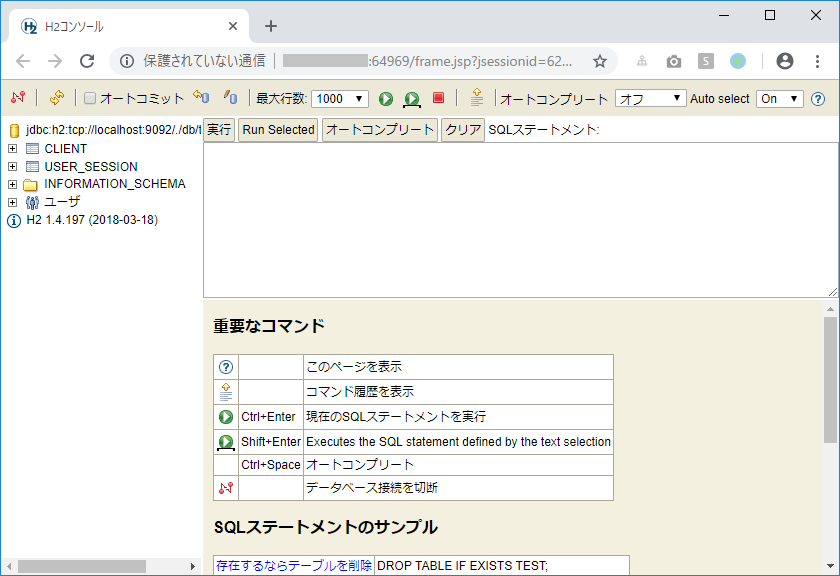

H2 Databaseに登録したデータを確認する
------------------------------------------

### 前提
- h2データベースが起動していること

### 手順

1. H2データベースコンソールを起動する<br>
Mavenコマンドを実行する [ [Windows向け](tipsForWin.md#mavenコマンドを実行する) | [Mac向け](tipsForMac.md#mavenコマンドを実行する) ] を参考にダイアログを開き、以下のコマンドを実行するとブラウザが立ち上がる。

    ```text
    exec:java@h2-console
    ```

    

2. 左側のペインのテーブル名をクリックすると、クリックしたテーブルに対するSELECT文が生成される。

3. [実行]ボタンをクリックすると、生成したSELECT文が実行され、テーブルのデータを確認することができる。
