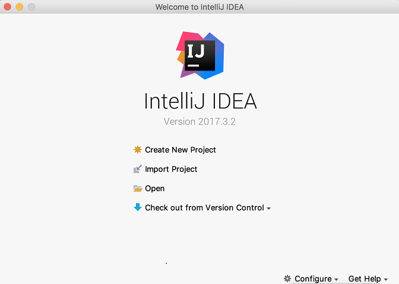
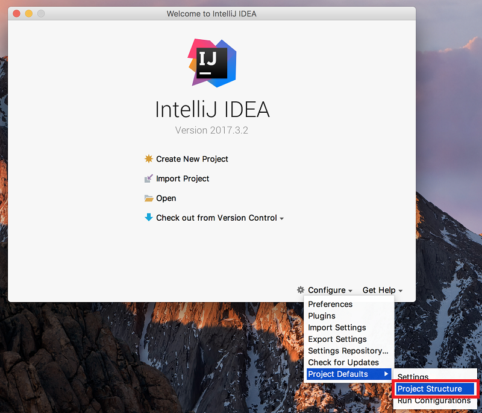
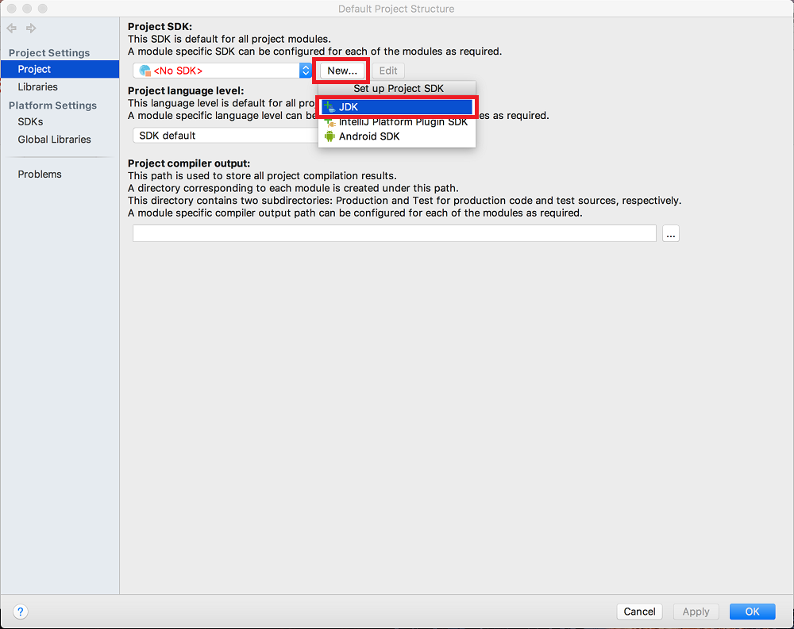
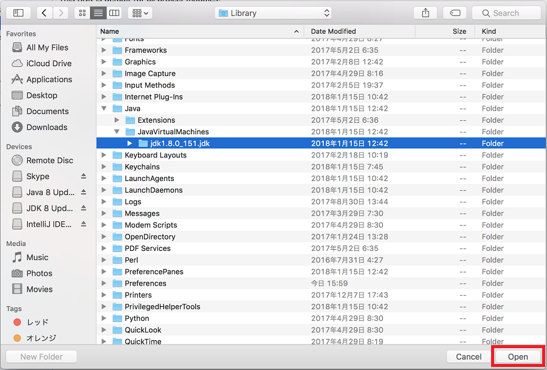
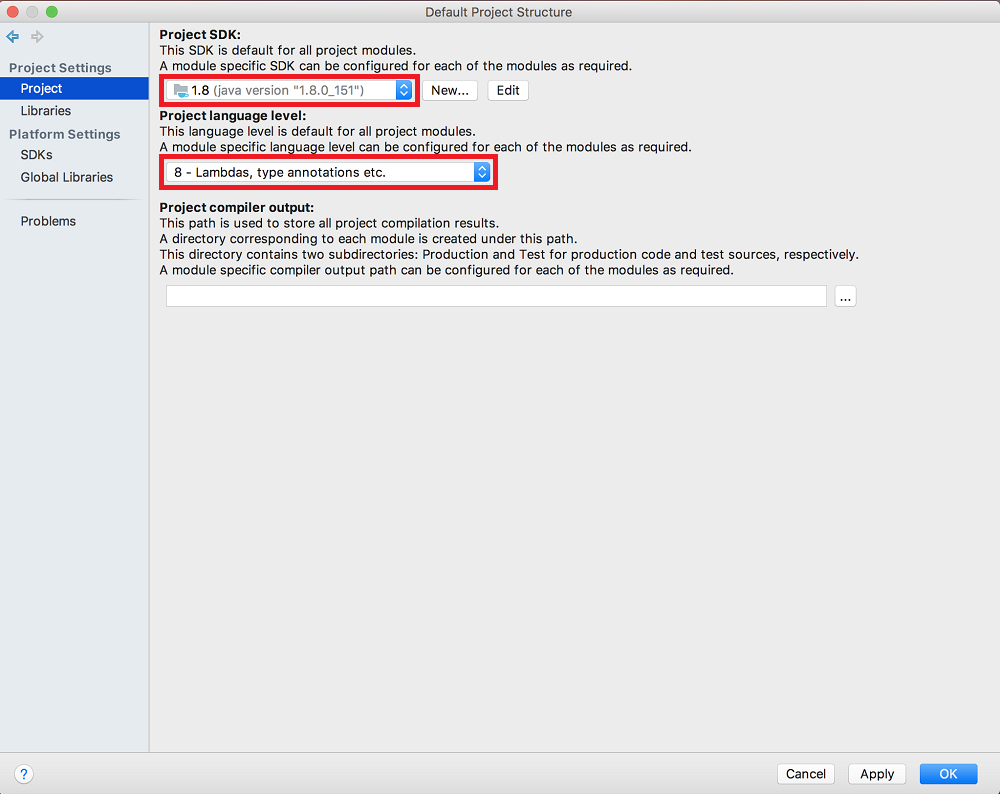

# IntelliJのインストール(Mac)

## 前提条件

* [Terminalを起動](tipsForMac.md#terminalの起動方法)して `java -version` とコマンドを入力した時、結果が返ってきますか？

## インストール

1. https://www.jetbrains.com/idea/#chooseYourEdition のDOWNLOADボタンから、**Community** のバージョンを選んでダウンロードしてください。
1. ダウンロードできたインストーラーをダブルクリックで起動し、表示される手順に従ってインストールを進めてください。

## IntelliJの実行

`Finder` > `アプリケーション` からIntelliJを起動してください。プライバシーポリシーへの同意を求められますので、同意して続けてください。 
起動中は下記のような画面が表示されます。 

起動が完了すると下記のような画面が表示されます。 

## SDKの設定

1. Welcome画面で[Configure]→[Project Defaults]⇒[Project Structure]と選択してください。 

1. [Project SDK]という見出しの下にあるプルダウンが＜No SDK＞になっていると思いますので、【New...】→【JDK】を選択してください。 

1. ご自身がインストールしたjdkの場所(/Library/Java/JavaVirtualMachines/jdk1.8.x_xxx.jdk)を選択して[Open]を押下してください。 

1. Project SDKが設定され、【1.8(java version "1.8.x_xxx")】が選択されるかと思います。
一つ下の項目「Project language level」は「8 - Lambdas, type annotations etc.」を選択し、[OK]を押下してください。 

