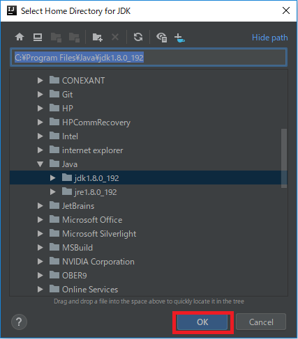

# IntelliJのインストール(Windows)

## 前提条件

* [コマンドプロンプトを起動](tipsForWin.md#コマンドプロンプトの起動方法)して `java -version` とコマンドを入力した時、結果が返ってきますか？

## インストール

1. https://www.jetbrains.com/idea/#chooseYourEdition のDOWNLOADボタンから、**Community** のバージョンを選んでダウンロードしてください。
1. ダウンロードできたインストーラーを起動して、表示される手順に従ってインストールを進めてください。よくわからない項目は変更せずに進めて構いません(Next, OK, Install 等)
。

## IntelliJの実行

インストールするとデスクトップにショートカットが作成されますので起動してください。 
起動中は下記のような画面が表示されます。 

起動が完了すると下記のような画面が表示されます。 

ショートカットが無い場合、スタートメニューのプログラム一覧から起動してください。 
 `JetBrains` > `IntelliJ IDEA Community Edition`

## SDKの設定

1. Welcome画面で[Configure]→[Project Defaults]⇒[Project Structure]と選択してください。 

1. [Project SDK]という見出しの下にあるプルダウンが＜No SDK＞になっていると思いますので、【New...】→【JDK】を選択してください。 

1. ご自身がインストールしたjdkの場所(C:\Program Files\Java\jdk1.8.x_xxx)を選択して[OK]を押下してください。 

1. Project SDKが設定され、【1.8(java version "1.8.x_xxx")】が選択されるかと思います。
一つ下の項目「Project language level」は「8 - Lambdas, type annotations etc.」を選択し、[OK]を押下してください。 

