# 自分のPCで動作確認用アプリを動かす(Mac)

## 前提条件

* [Terminalを起動](tipsForMac.md#terminalの起動方法)して `java -version` とコマンドを入力した時、結果が返ってきますか？
* [Terminalを起動](tipsForMac.md#terminalの起動方法)して `git --version` とコマンドを入力した時、結果が返ってきますか？

## 手順
1. IntelliJでプロジェクトをcloneする
2. ソースコード確認
3. Gitの設定
4. Webアプリケーションの起動確認

### 1. IntelliJでプロジェクトをcloneする

1. ユーザフォルダ配下に `IdeaProjects` フォルダを作成します。
    - (例) `/Users/ユーザ名/IdeaProjects`
1. IntelliJを起動し、 `Check out from Version Control > Git` を選択します。
1. URLに `https://github.com/tiscon/tiscon4-pre.git` を入力します。<br>
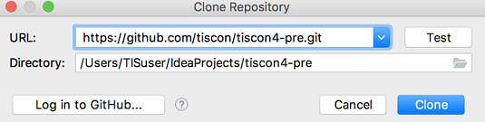
1. Cloneボタンを押下します。
1. 画面下部にステータスが表示されます。バーの表示が消えればcloneは完了です。<br>
下図のような画面が表示された場合、『Yes』を選択してプロジェクトを開いてください。<br>
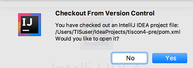

#### プロジェクトを開く

上記clone手順の最後で『No』を選択した場合、手動でプロジェクトを開きます。<br>
clone時にプロジェクトを開いた場合は以下の手順を飛ばしてください。

1. IntellijのWelcome画面からOpenを選択します。<br>
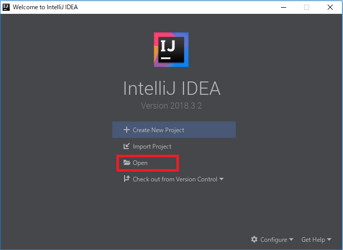

1. `/Users/ユーザ名/IdeaProjects/tiscon4-pre` を選択し、Openを押します。<br>
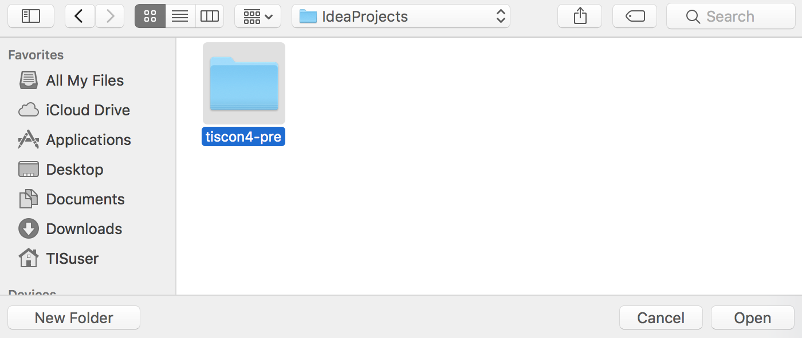

1. tiscon4事前動作確認用プロジェクトが開けました。続いてソースコードを確認できるようにします。<br>
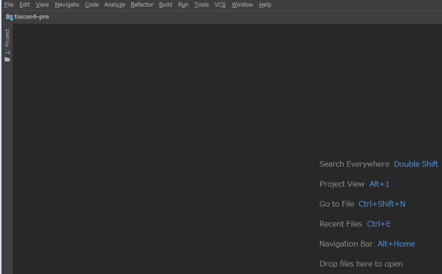

### 2. ソースコード確認

1. IntelliJ上部メニューバーから、`View > Tool Windows > Project` を選択します。<br>
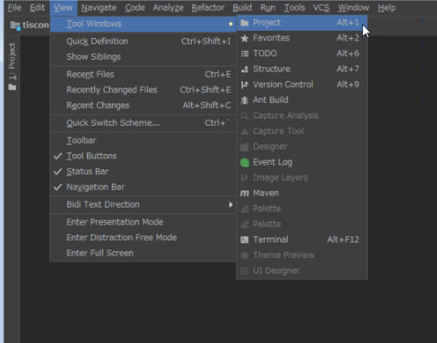

1. Project Viewよりプロジェクト内のソースコードが確認できるようになりました。<br>
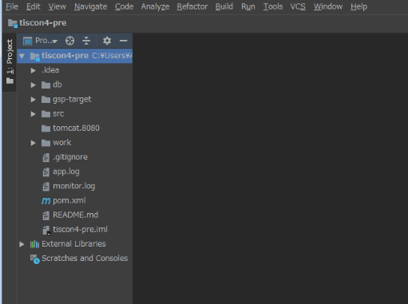

### 3. [Git](https://git-scm.com/)の設定

今後の作業内容をあなたのGitHubアカウントに紐付けられるようにします。

1. IntelliJ上部メニューバーから、`View > Tool Windows > Terminal` を選択します。<br>

1. Terminal画面が表示されるので、以下を入力してください。<br>
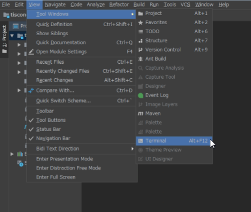
```sh
git config user.name GitHubのユーザ名
git config user.email GitHubのメールアドレス
```
コマンド実行後、何もエラーメッセージが表示されなければ設定完了です。


### 4. Webアプリケーションの起動確認

cloneしたWebアプリケーションが正常に動くか、開発ローカル(自PC)上で動作確認を行います。

##### 1. H2データベースを起動する
[Mavenコマンドを実行する](tipsForMac.md#mavenコマンドを実行する)を参考にダイアログを開き、以下のコマンドを実行します。

```text
exec:java@h2-start
```

以下のように `server running` の旨が表示されれば成功です。<br>
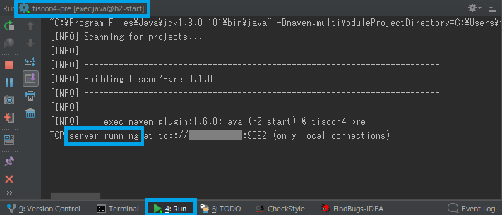

##### 2. データベースの中身を初期セットアップする  
[Mavenコマンドを実行する](tipsForMac.md#mavenコマンドを実行する)を参考にダイアログを開き、以下のコマンドを実行します。

```text
-P gsp clean generate-resources
```

以下のように `BUILD SUCCESS` の旨が表示されれば成功です。
（完了まで少し時間がかかることがあります。）

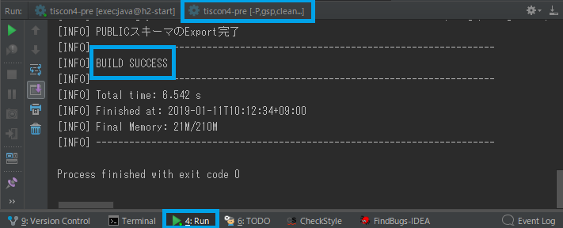

##### 3. アプリケーションを起動する 
[Mavenコマンドを実行する](tipsForMac.md#mavenコマンドを実行する)を参考にダイアログを開き、以下のコマンドを実行します。

```text
clean compile waitt:run
```

コマンド実行後、自動で下記の画面が立ち上がります。
（自動表示されない場合は、ブラウザから http://localhost:9080 にアクセスしてください。）

##### 4. ブラウザで画面表示を確認する  
以下の画面が表示されていることを確認します。

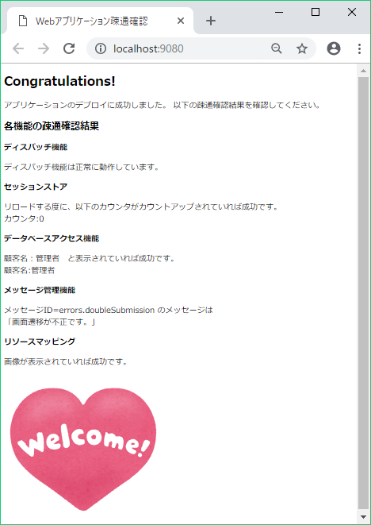

##### 5. アプリケーションを終了する
動作が確認できたらアプリケーションを終了しましょう。<br>
Runの`tiscon4-pre[clean,compile,waitt:run]`のタブを開いた状態で左の停止ボタンを押します。

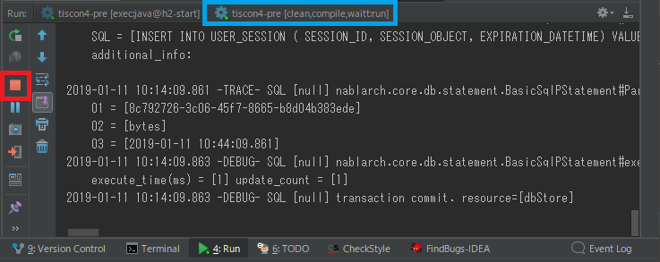

##### 6.  H2データベースを終了する
次にH2データベースを終了しましょう。<br>
Runの`tiscon4-pre[exec:java@h2-start]`のタブを開いた状態で左の停止ボタンを押します。

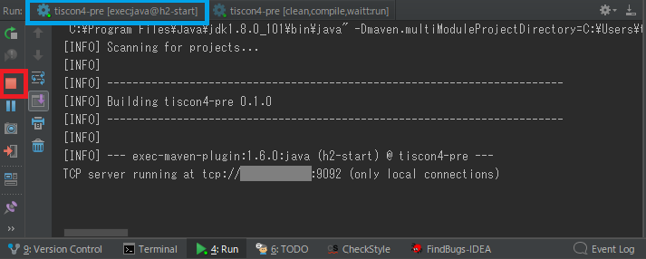

#### お疲れ様でした！
