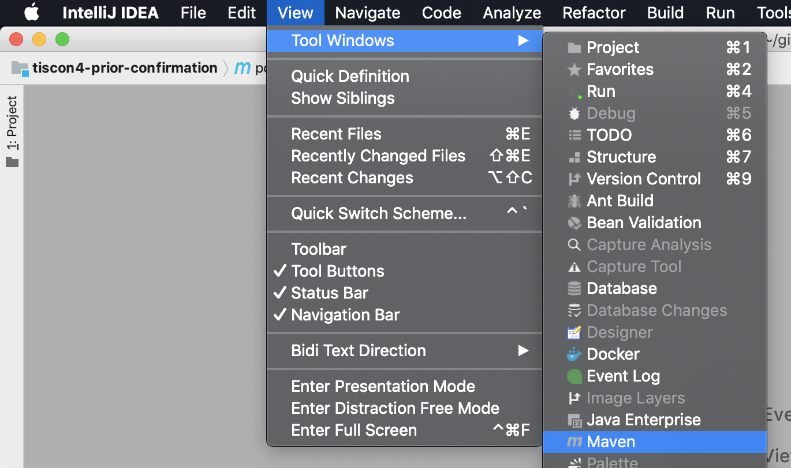
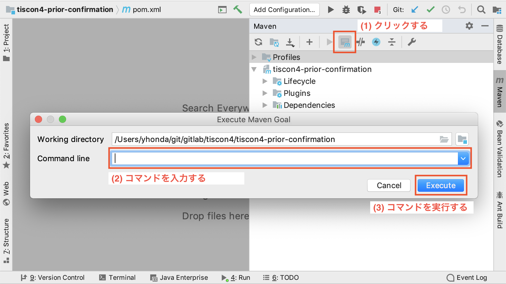

Macマシンの開発TIPS
----------------------------------------

### Terminalの起動方法

Terminalとは、いわゆる「黒い画面」です。

環境構築手順において、時々Terminalからコマンドを実行する必要があります。
Terminalは、以下の手順で起動できます。

`Finder` > `アプリケーション` > 'ユーティリティ' > `ターミナル` を選択

## IntelliJ
### Mavenコマンドを実行する
図のように `View > Tool Windows > Maven` を選択します。

    

開いた **Mavenメニュー** よりダイアログを開きます。 
（以前に入力したコマンドがCommand line欄に残っている場合がありますが、消して問題ありません。）

    

開いたダイアログのCommand lineに実行したいコマンドを入力します。 
**[Execute]** ボタンを押しコマンドを実行します。
